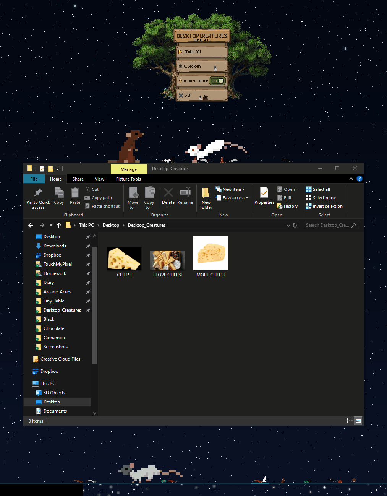
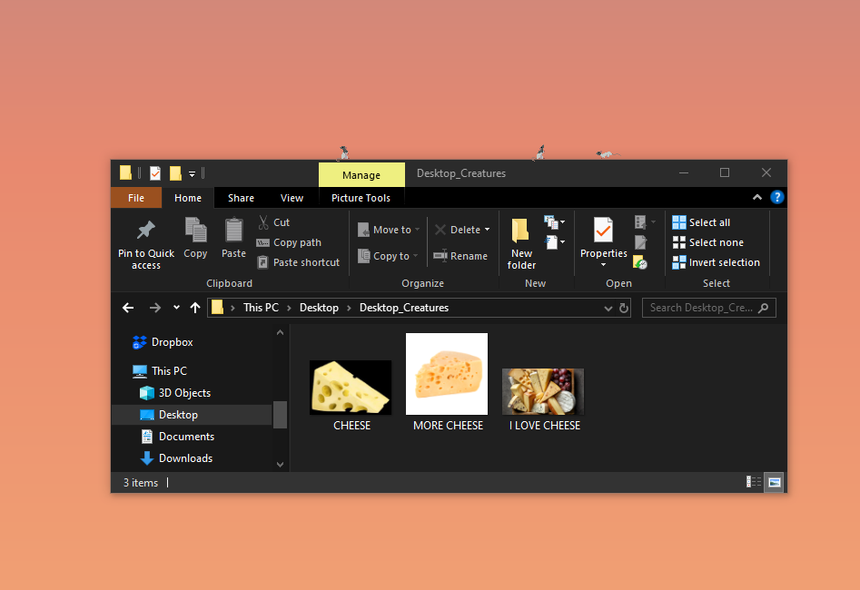
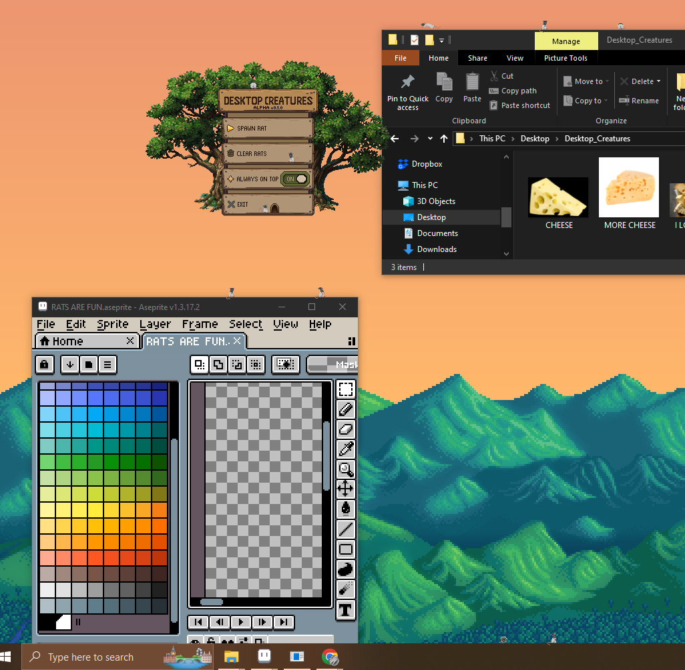
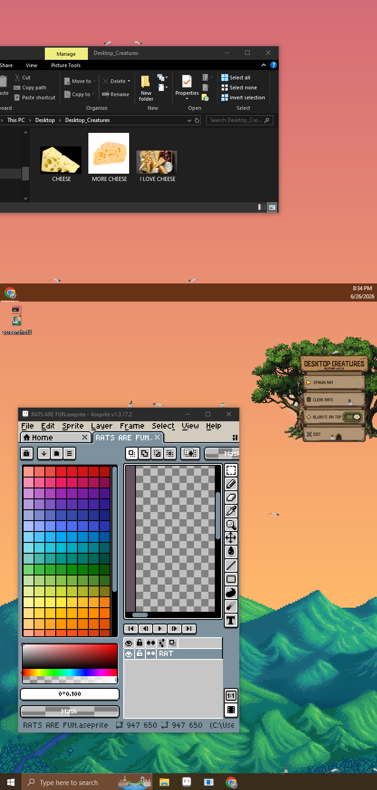

# Desktop Rat Alpha v0.1.0

**Created by Paulina Grey**

Desktop Rat is an experimental C# desktop companion built on a modular creature framework designed to support autonomous AI behaviors, reusable systems, and future creature types.

Spawn tiny pixel-art rats, drag them around your desktop, and watch them explore your windows while making surprisingly independent life decisions.

---

## Software Engineering Highlights

- Modular creature framework supporting multiple creature types
- Autonomous AI behavior system with configurable state transitions
- Reusable movement, animation, needs, and scheduling systems
- Windows Forms desktop rendering and interaction
- Multi-monitor support
- Extensible architecture designed to minimize code duplication
- Continuous refactoring to improve maintainability and future expansion

## Technologies

- C#
- .NET
- Windows Forms
- Git
- Aseprite

---

## Current Features

- 🐀 Spawn multiple autonomous rats
- 🍎 Needs-driven behaviors including eating and wandering
- 🎞️ Pixel-art animation system
- 🪟 Rats navigate across desktop windows
- 🖱️ Drag and reposition any rat
- 🖥️ Multi-monitor support
- 🌳 Pixel-art forest menu
- ⚙️ Configurable global timing system
- 🐀 Rats search for food and interact with world objects.

---

## Why I Built It

Desktop pets have always made computers feel a little more alive, but I wanted to build creatures that behaved less like scripted animations and more like tiny autonomous companions.

One of the primary goals of this project is creating reusable systems that allow entirely new creature types to be implemented with minimal additional code. Rather than hardcoding behavior for individual creatures, common functionality is continually being refactored into shared systems that can be reused throughout the project.

...also I really wanted tiny pixel rats running across my monitors.

---

## Setup

1. Download and extract the ZIP file.
2. Run `Desktop_Creatures.exe`.
3. A tiny rat will appear sitting on the forest menu.

---

## Controls

- **Spawn Rat** — Create another rat.
- **Clear Rats** — Remove all rats.
- **Always On Top** — Keep rats above other windows.
- **Exit** — Close Desktop Rat.
- **Drag with the mouse** — Pick up and move any rat.

---

## Planned Features

- Additional creature species
- Creature interactions
- Toys and environmental objects
- Saving and loading
- Expanded needs and personality systems
- Seasonal behaviors
- User interaction improvements

---

## Alpha Status

Desktop Rat is an active alpha project.

Current known limitations include:

- Some windows may still be detected as walkable even when partially obscured.
- Extremely large numbers of creatures may reduce performance.
- Features and behaviors are actively changing between releases.

Feedback and bug reports are always appreciated!

---

## Screenshots

### Multiple Rats

### Forest Menu

### Multi-Monitor Support

---

I hope these little rats brighten your desktop. ❤️
